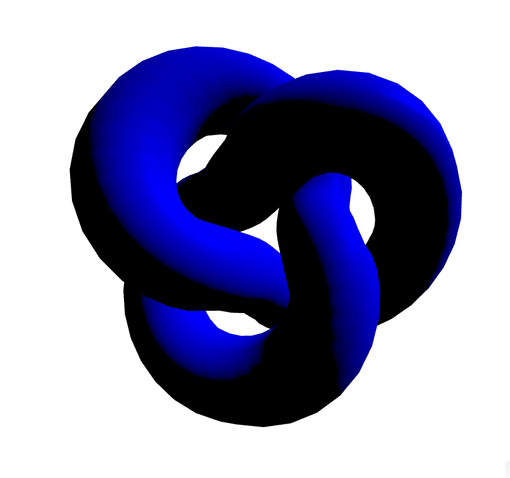

# Entry 4
##### 3/3/25

## Choosing a Tool

It's been a bit since I have wrote about my freedom project, and that is on me, as I did not write a Blog 3 and write little for Blog 2. But, we are back, and we have finished all of our research on our topic. Researching Aviation was somewhat tough, as it was difficult to find direct answers for the physical hardware of Aviation. For the second semester, we have now began to implement code into our project. One part of the Freedom Project is to find a tool that uses code, and implement it into our project. I chose the tool [A-Frame](https://aframe.io/). A-Frame focuses on making a 3D world, along with incorporating it into a Augmented (AR) and Virtual Reality (VR) experience. This tool stood out to me mainly because you can design anything you want, and also that it would be easy to make a visual representation with my topic, Aviation. I decided to incorporate A-Frame into the Freedom Project by designing a virtual cockpit, and I would like for it to be interactive. 

## Learning and tinkering with A-Frame

When it comes to actually learning the tool, my comprehension of how to work A-Frame mainly came from videos. In total, I have so far watched four videos on different aspects of A-Frame, such as **Lighting** and **Skybox**. Examples of these were videos such as [What is A-Frame?](https://www.youtube.com/watch?v=ktjMCanKNLk) and [A-Frame Tutorial: Basic Lighting](https://www.youtube.com/watch?v=9soV6wZsg40). One thing that I tried was to create a big blue knot in the center of the stage with some black lighting on it as well. Below was the code performed for this
````html
     <a-torus-knot height="2" width="2"></a-torus-knot>
     <a-camera position='0 0 3' user-height='0'></a-camera>
     <a-light type="directional" color="blue" position="1 1 0"></a-light>
````
This is what the result looks like:
<br>
<br>

<br>
<br>
In another instance, I did the same thing that would center the knot, but with a new sunset background (skybox) being in the frame.
````html
    <a-torus-knot height="2" width="2"></a-torus-knot>
    <a-camera position='0 0 2.5' user-height='0'></a-camera>
    <a-sky src="sunset-lonely-street.jpg"></a-sky>
````
The experience of learning about A-Frame was great and it opens up a whole new world of what you can make in HTML, especially with everything running basically behind the scenes. 

## Skills

The first skill I have learned along this part of the journey was **

[Previous](entry03.md) | [Next](entry05.md)

[Home](../README.md)
