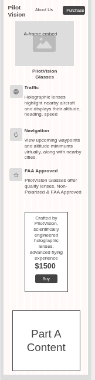
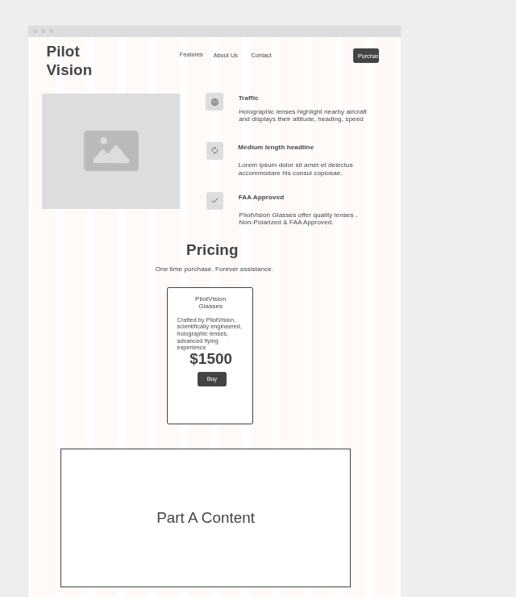

# Entry 6
##### 5/12/25

## Follow-Up, A-Frame

The last entry that was posted on this blog was Entry 4, and we went over the LOYO (Learn On Your Own) aspect of the Freedom Project. I talked about how I chose my tool A-Frame, with the intention of designing virtual cockpit by learning about how A-Frame works and testing things out, slowly making my way to the design of a virtual cockpit. Now, this did not go as planned as I did not think about the complexity of designing a virtual cockpit. Along with this, and procrastination, I changed my invention to the [PilotVision Glasses](lucah8212.github.io/sep10-freedom-project), which are holographic glasses that assist pilots by displaying important information right in front of your eyes. 

## How I made my MVP

Now, if we're being honest, my MVP wasn't done until the day before presentations, which was May 15th. The MVP was supposed to be done 2 weeks before, and this is due to my laziness of not completing my work when Mr. Mueller gave us time to work in class. I learned the hard way. Anyways - my MVP was made in a way where I focused on presenting my invention first on my website, so this meant spending more time focusing on my Part B section of the website, which included the description of my product, and most importantly the A-Frame scene. Below are the wireframes I made for my planning.

 

You should be able to tell which one is mobile, and which one is desktop. When it came to turning this into a website, the first thing I focused on was the Navbar, which I was able to tinker with by reading the documents from [Bootstrap](https://getbootstrap.com/docs/5.3/components/navbar/). I then focused on inserting the written content from the wireframe, specifically the description of my product. (Traffic, FAA Approved, glasses cost $1500, etc.) Doing these things were fairly easier than other parts of my website, which I will get into.

## Challenges

One major challenge that I faced during making my MVP was putting my A-Frame scene on my website. As you can see in the wireframe, the goal was to have an embed of my A-Frame scene as an interactive image, next to the description of the glasses. 

````html
<div class="col-lg-6">
  <a-scene embedded>

    <a-entity camera wasd-controls look-controls position="0 1.6 5"></a-entity>

  <!-- my a-frame scene -->

  </a-scene>
</div>
````

This resulted in the embed of the A-Frame popping up, but the scene would never load. When you first enter a website with an A-Frame embed on it, it displys a blue screen with 3 loading white dots, and this usually would take a couple seconds for the scene to load. What happened to me is that the 3 white dots never stopped loading and my scene was never visible. I took this up with Mr. Mueller, and even he himself could not figure out what the problem is. My solution to this was to take a screenshot of my A-Frame scene in a different file, where it worked, and attach it to my website as a clickable link.

````html
<div class="col-lg-6">
  <div class="photoglasses">
    <a href="aframe.html"></a>
    <p>PilotVision Glasses (click photo)</p>
  </div>
</div>
````

This resulted in a clickable image, where it would lead to a seperate [A-Frame file](https://lucah8212.github.io/sep10-freedom-project/aframe.html).

[Previous](entry05.md) | [Next](entry07.md)

[Home](../README.md)
